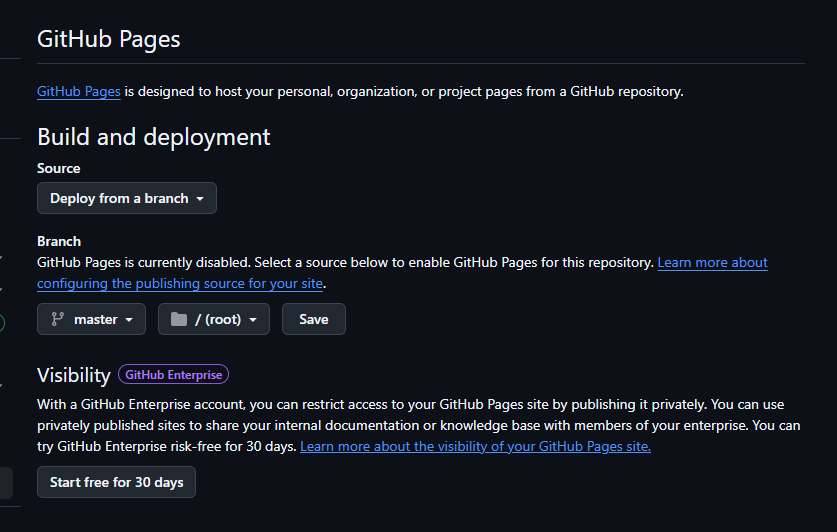

<!--
_class: lead
_paginate: skip
-->

# Pelatihan Pengembangan Web Resume Online dengan Git dan Github

---

# JIMMY, S.Kom, M.Kom

_Dosen Fakultas Sains dan Teknologi Universitas IBBI_

---

<!--

_paginate: skip
-->

# Materi Pelatihan hari ini

- _**Codespaces**_ sebagai Cloud IDE
- Resume sebagai _**Online Self Branding**_
- _**Markdown**_ sebagai Text Formatter
- Mengelola Proyek dengan _**Git**_
- Mengirim Kode ke _**GitHub**_
- Publish Website dengan _**GitHub Pages**_

---

<!--
_class: center
_paginate: skip
-->

# Environment Setup

- Visual Studio Code (https://code.visualstudio.com/)
- Git (https://git-scm.com/)
- GitHub Account (https://github.com/)
- Internet Stabil

---

# Codespaces sebagai IDE di Cloud


---

## Apa itu Codespaces?

Codespaces adalah _**Integrated Development Environment (IDE)**_ berbasis cloud yang terintegrasi dengan GitHub dan menggunakan antarmuka seperti _**Visual Studio Code**_ langsung di browser. Membantu kolaborasi tanpa perlu setup lokal.

---

## Membuat Codespace Baru

1. https://github.com/features/codespaces
2. _Login_ dengan akun GitHub
3. Klik _Get Started for free_
4. Pilih _Blank_ template
5. Tunggu environment siap.


---

# Resume sebagai Online Self Branding


---

## Pentingnya Resume Online

Menunjukkan profil profesional yang mudah diakses. Meningkatkan visibilitas bagi rekruter dan rekan kerja.

---

## Platform Resume Online

- **LinkedIn.com:** Jejaring profesional.
- **GitHub.com Profile:** Menampilkan deskripsi diri.
- **Personal site:** lewat hosting mandiri atau GitHub Pages.

---

# Markdown sebagai Text Formatter

---

## Pengantar Markdown

Markdown adalah bahasa ringan untuk memformat teks agar mudah dibaca dan fleksibel di berbagai platform.

---

## Sintaks Markdown Dasar

```markdown
# Heading Level 1

## Heading Level 2

**Tebal** dan _Miring_

- Item pertama
- Item kedua

[Link ke GitHub](https://github.com)


```


---

## Contoh Resume Sederhana

```markdown
# Curriculum Vitae


## Data Pribadi

- **Nama:** Andi Pratama
- **Alamat:** Jl. Merdeka No. 123, Jakarta
- **Telepon:** 0812-3456-7890
- **Email:** andi.pratama@email.com
- **LinkedIn:** [linkedin.com/in/andipratama](https://linkedin.com/in/andipratama)

---
```

---

```markdown
## Pendidikan

- **SD Bodhicitta Medan**
  2013 - 2019
- **SMP Bodhicitta Medan**
  2019 - 2022
- **SMA Bodhicitta Medan**
  Jurusan IPA — 2022 - 2025

---
```

---

# Git sebagai Version Control Repository

---

## Apa itu Version Control?

Version Control adalah sistem yang merekam perubahan pada file atau sekumpulan file dari waktu ke waktu.

---

Dengan version control, Anda dapat:

- Melacak setiap perubahan yang dibuat
- Kembali ke versi sebelumnya jika diperlukan
- Melihat siapa yang membuat perubahan dan kapan
- Bekerja secara bersamaan dengan tim tanpa konflik

---

## Kendala Tanpa Version Control

- Resume-1.0.txt
- Resume-1.1.txt
- Resume-final.txt
- Resume-final-final.txt
- Resume-final-100-persen.txt

---

# Version Control dengan Git

Git melacak perubahan setiap file dari waktu ke waktu, mendukung revert, branch, dan merge.

```sh
Resume.txt

30f928e (HEAD -> master) Menambahkan bagian Sertifikasi
        dan Bahasa dengan sertifikat web development
        dan kemampuan bahasa
c571a0d Menambahkan bagian Keahlian dengan bahasa pemrograman,
        framework, database, dan tools
0025d88 Menambahkan bagian Prestasi dengan juara lomba coding,
        finalis hackathon, dan beasiswa IT
0c72ad0 Commit pertama: Menambahkan resume Andi Pratama
        dengan foto profil dan riwayat pendidikan
```

---

# Implementasi Version Control dengan Git

---

## Info Tambahan Resume

```markdown
## Prestasi

- [Juara 1 Lomba Coding Nasional 2023](https://lombacodingnasional.com)
- [Finalis Hackathon Indonesia 2022](https://hackathonindonesia.com)
- [Penerima Beasiswa Prestasi IT 2021](https://beasiswaprestasiit.com)

---

## Keahlian

- **Bahasa Pemrograman:** JavaScript, Python, PHP
- **Framework & Library:** React, Node.js, Express, Bootstrap
- **Database:** MySQL, MongoDB, SQLite
- **Tools:** Git, Figma, VS Code

---
```

---

```markdown
## Sertifikasi

- Dicoding — Belajar Frontend Web Developer (2022)
- FreeCodeCamp — Responsive Web Design (2021)

---

## Bahasa

- Bahasa Indonesia (Lancar)
- Bahasa Inggris (Menengah)
```

---

# GitHub


---

## GitHub sebagai Hosting Kode

GitHub adalah platform berbasis **cloud** yang digunakan untuk menyimpan, mengelola, dan berbagi kode secara online. Dengan GitHub, kolaborasi antar developer menjadi lebih mudah, serta memungkinkan versi kode tersimpan dengan aman dan dapat diakses dari mana saja.

---

## Mengirim / Push Kode ke GitHub

---

## GitHub Pages

GitHub Pages adalah fitur dari GitHub yang memungkinkan pengguna untuk **meng-host situs web statis** langsung dari repositori GitHub. Dengan GitHub Pages, Anda dapat dengan mudah membuat dan menerbitkan situs web untuk proyek, portofolio, atau dokumentasi.

---

## Menyiapkan Publikasi

1. Masuk repo → **Settings** → **Pages**.
2. Pilih branch: `main / master`.
3. Pilih folder `/root`.



---

## Contoh Url Github Pages

username : `andi-pratama`
repo : `resume-online`

Halaman akan tersedia di `https://andi-pratama.github.io/resume-online/`.

---

<!--
_class: lead
_paginate: skip
-->

# Terima Kasih
